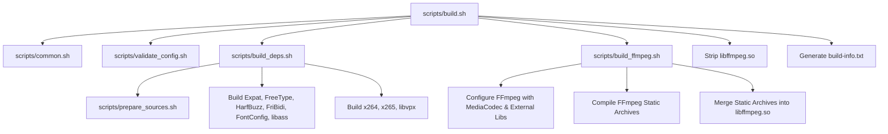

# FFmpeg Android 13+ Builder for Expo & React Native

A battle-tested, high-performance cross-compilation pipeline designed to build custom FFmpeg Android shared libraries (`libffmpeg.so`) optimized for **Expo Nitro Modules**, **React Native Native Modules**, and mobile video editor applications.

---

## 📋 Table of Contents

- [Overview & Architectural Design](#-overview--architectural-design)
- [What Gets Built](#-what-gets-built)
- [Build Pipeline & Architecture](#-build-pipeline--architecture)
- [Core FFmpeg & Dependency Stack](#-core-ffmpeg--dependency-stack)
- [Hardware Acceleration (MediaCodec)](#-hardware-acceleration-mediacodec)
- [Software Codecs & Containers](#-software-codecs--containers)
- [Subtitle & Text Rendering Engine](#-subtitle--text-rendering-engine)
- [Configuration Matrix](#-configuration-matrix)
- [Troubleshooting & Solved Issues](#-troubleshooting--solved-issues)
- [Local Build Prerequisites & Setup](#-local-build-prerequisites--setup)
- [GitHub Actions & CI/CD](#-github-actions--cicd)
- [Expo & React Native Integration Guide](#-expo--react-native-integration-guide)
- [Example FFmpeg Commands](#-example-ffmpeg-commands)
- [License & Legal Notice](#-license--legal-notice)

---

## 🚀 Overview & Architectural Design

This repository automates the compilation of FFmpeg for Android using modern toolchains and optimized target settings:

- **Target OS & API**: Android API Level 33+ (Android 13+)
- **Architecture**: `aarch64` (`arm64-v8a` ABI)
- **Toolchain**: Android NDK `r26d` with Clang/LLVM cross-compilation
- **Library Packaging**: Single merged shared library (`libffmpeg.so`) combining FFmpeg core, `libass` subtitle stack, `x264`, `x265`, and `libvpx`
- **Optimization**: Link-Time Optimization (`ENABLE_LTO=yes`), symbol visibility hiding (`-Wl,--exclude-libs,ALL`), and post-build binary stripping (`llvm-strip`)
- **CI/CD Pipeline**: Automated GitHub Actions running on Node.js 24 runtime, auto-publishing builds to GitHub Releases and Actions Artifacts

---

## 📦 What Gets Built

### Local Build Outputs

Running `bash scripts/build.sh` produces:

```text
output/
├── libs/
│   └── libffmpeg.so        # Monolithic shared library containing all codecs & libass
├── ffmpeg                  # Standalone CLI tool (optional, controlled by BUILD_FFMPEG)
├── ffprobe                 # Standalone probe tool (optional, controlled by BUILD_FFPROBE)
└── build-info.txt          # Detailed compilation metadata & enabled features summary
```

### GitHub Actions Release Packages

GitHub Actions creates:

```text
release/
├── ffmpeg-android-arm64-v8a.tar.gz   # Full compressed output archive
├── libffmpeg.so                     # Standalone shared library for direct download
├── build-info.txt                   # Compilation summary and feature list
└── release-notes.md                 # Markdown summary for GitHub Releases
```

---

## 🏗️ Build Pipeline & Architecture

The build process is structured into decoupled, maintainable shell scripts in the `scripts/` directory:

```text
.
├── configs/                # Configuration files defining feature flags
│   ├── ffmpeg.conf         # Core build target, API level, & feature switches
│   ├── codecs.conf         # Software & MediaCodec codec configurations
│   ├── containers.conf     # Muxers & demuxers configuration
│   ├── filters.conf        # Audio/video/text filter switches
│   └── subtitles.conf      # Subtitle engine & font configuration
├── scripts/
│   ├── common.sh           # Environment loader (NDK paths, CC/CXX/AR/STRIP definitions)
│   ├── validate_config.sh  # Pre-build validation of host tools & environment variables
│   ├── prepare_sources.sh # Downloads & extracts FFmpeg and dependency source code
│   ├── build_deps.sh       # Compiles dependency libraries (Expat, FreeType, HarfBuzz, FriBidi, FontConfig, libass, x264, x265, libvpx)
│   ├── build_ffmpeg.sh     # Configures FFmpeg core, links static deps, and generates single libffmpeg.so
│   └── build.sh            # Top-level orchestrator script
```

### Script Execution Sequence



---

## 📚 Core FFmpeg & Dependency Stack

The single `libffmpeg.so` shared library is flattened from the following static components:

### Core FFmpeg Libraries
- `libavcodec` — Audio/video codecs
- `libavformat` — Container demuxers and muxers
- `libavfilter` — Video and audio processing filters
- `libavdevice` — Input/output devices
- `libavutil` — Core utility functions
- `libswscale` — Color conversion and scaling
- `libswresample` — Audio resampling and channel mixing

### External Dependencies
- `libass` (0.17.1) — Advanced SubStation Alpha subtitle renderer
- `FontConfig` (2.15.0) — Font configuration and matching library
- `FreeType` (2.13.2) — Font rasterization engine
- `HarfBuzz` (8.5.0) — Text shaping engine for complex scripts
- `FriBidi` (1.0.15) — Unicode Bidirectional Algorithm implementation
- `Expat` (2.6.2) — XML parser (FontConfig dependency)
- `x264` (stable branch) — H.264 software encoder
- `x265` (4.1) — H.265 / HEVC software encoder
- `libvpx` (1.15.2) — VP8 / VP9 software encoder and decoder

---

## ⚡ Hardware Acceleration (MediaCodec)

Android MediaCodec hardware acceleration is enabled to offload video encoding and decoding to device NPU/GPU/VPU hardware:

### Hardware Decoders
- `h264_mediacodec`
- `hevc_mediacodec`
- `vp8_mediacodec`
- `vp9_mediacodec`

### Hardware Encoders
- `h264_mediacodec`
- `hevc_mediacodec`

*Note: VP8 and VP9 hardware support on Android is decode-only.*

---

## 🎞️ Software Codecs & Containers

### Native Video Codecs
- **Decoders & Encoders**: H.264, H.265 / HEVC, VP8, VP9, MPEG-4 Part 2, MJPEG

### Native Audio Codecs
- **Decoders & Encoders**: AAC, MP3, FLAC, Opus, PCM / WAV

### External Encoders & Decoders
- `libx264`: H.264 software encoding (`ENABLE_X264=yes`)
- `libx265`: H.265 / HEVC software encoding (`ENABLE_X265=yes`)
- `libvpx`: VP8 and VP9 software encoding and decoding (`ENABLE_LIBVPX=yes`)

### Muxers & Demuxers
- **Enabled Containers**: MP4, MOV, MKV (Matroska), WebM, MP3, WAV, FLAC
- **Protocols**: `file`, `http`, `https`

---

## 🎨 Subtitle & Text Rendering Engine

The build includes a full **libass** subtitle rendering engine supporting styled SSA/ASS, SRT, and WebVTT captions:

### Subtitle Features
- Burn-in subtitle rendering directly into video frames (`-vf subtitles=...`)
- Advanced SSA/ASS styled rendering with custom fonts
- Font styling (bold, italic, underline, strikeout)
- Custom outline stroke, drop shadows, and text background rectangles
- Fine-grained x/y positioning and alignment controls
- Full UTF-8 text support for international character sets
- Right-to-Left (RTL) script support (Arabic, Urdu, Hebrew, Persian) via FriBidi and HarfBuzz shaping
- System font integration (`/system/fonts`) and embedded font cache via FontConfig

---

## ⚙️ Configuration Matrix

Build options are configured via files in `configs/`:

### Key Flags (`configs/ffmpeg.conf`)

| Flag | Default | Description |
| :--- | :--- | :--- |
| `ANDROID_API` | `33` | Target Android API level |
| `TARGET_ARCH` | `aarch64` | Target CPU architecture |
| `TARGET_ABI` | `arm64-v8a` | Target Android ABI |
| `ENABLE_MEDIACODEC` | `yes` | Enables Android MediaCodec hardware acceleration |
| `ENABLE_LIBASS` | `yes` | Enables libass subtitle renderer |
| `ENABLE_X264` | `yes` | Enables x264 software encoder |
| `ENABLE_X265` | `yes` | Enables x265 HEVC software encoder |
| `ENABLE_LIBVPX` | `yes` | Enables libvpx VP8/VP9 software encoder/decoder |
| `ENABLE_LTO` | `yes` | Enables Link-Time Optimization |
| `STRIP_BINARIES` | `yes` | Strips symbol tables from final output `.so` |
| `OUTPUT_SINGLE_SO` | `yes` | Flattens all static archives into single `libffmpeg.so` |

---

## 🛠️ Troubleshooting & Solved Issues

### Solved Issue: `llvm-strip` Failure during `libvpx` Compilation

#### Symptom
```text
/home/runner/work/ffmpeg/ffmpeg/android-ndk-r26d/toolchains/llvm/prebuilt/linux-x86_64/bin/llvm-strip: error: 'libvpx_g.a(vpx_decoder.c.o)': The file was not recognized as a valid object file
```

#### Root Cause
During cross-compilation with Android NDK LLVM toolchain, `libvpx` configure step was attempting to strip intermediate object files (`libvpx_g.a(vpx_decoder.c.o)`) using `llvm-strip`, causing file format misinterpretation.

#### Fix Applied
Added `--disable-strip` to the `libvpx` configure invocation in [scripts/build_deps.sh](file:///d:/Expo/ffmpeg/scripts/build_deps.sh):

```bash
./configure \
  --target=arm64-android-gcc \
  --prefix="$PREFIX" \
  --enable-vp8 \
  --enable-vp9 \
  --enable-pic \
  --enable-static \
  --disable-shared \
  --disable-examples \
  --disable-tools \
  --disable-docs \
  --disable-unit-tests \
  --disable-install-bins \
  --disable-strip \
  --extra-cflags="$CFLAGS"
```

This prevents `libvpx` from attempting intermediate stripping during library compilation, while keeping final binary stripping enabled in `build.sh` for `libffmpeg.so`.

---

## 💻 Local Build Prerequisites & Setup

### Environment Requirements

- **OS**: Linux (Ubuntu 22.04 LTS or 24.04 LTS recommended) or WSL2 on Windows
- **Android NDK**: Version `r26d`

### Package Dependencies (Ubuntu / Debian)

```bash
sudo apt update && sudo apt install -y \
  git \
  wget \
  unzip \
  curl \
  pkg-config \
  build-essential \
  autoconf \
  automake \
  cmake \
  gettext \
  gperf \
  libtool \
  xz-utils \
  yasm \
  nasm \
  meson \
  ninja-build
```

### Running the Build

1. Download Android NDK r26d and export its path:
   ```bash
   wget https://dl.google.com/android/repository/android-ndk-r26d-linux.zip
   unzip android-ndk-r26d-linux.zip
   export NDK=$PWD/android-ndk-r26d
   ```

2. Make scripts executable:
   ```bash
   chmod +x scripts/*.sh
   ```

3. Run the full build pipeline:
   ```bash
   bash scripts/build.sh
   ```

---

## 🤖 GitHub Actions & CI/CD

Workflow configuration is located in `.github/workflows/android.yml`.

- **Triggers**: Manual trigger via `workflow_dispatch` or push of git tag `v*`
- **Actions Runtime**: Node.js 24
- **Artifacts**: Uploads `output/` directory as an artifact (`ffmpeg-android-arm64-v8a`)
- **Releases**: Publishes compiled `libffmpeg.so` and `ffmpeg-android-arm64-v8a.tar.gz` directly to GitHub Releases using `softprops/action-gh-release@v3`

---

## 📱 Expo & React Native Integration Guide

### 1. Place `libffmpeg.so` in your Android project

Copy `libffmpeg.so` into your native Android module structure:

```text
android/app/src/main/jniLibs/arm64-v8a/libffmpeg.so
```

### 2. Loading the Library in Java/Kotlin

In your React Native Native Module or Expo Nitro Module:

```kotlin
package com.mycompany.ffmpeg

import com.facebook.react.bridge.ReactApplicationContext
import com.facebook.react.bridge.ReactContextBaseJavaModule
import com.facebook.react.bridge.Promise

class FFmpegModule(reactContext: ReactApplicationContext) : ReactContextBaseJavaModule(reactContext) {

    companion object {
        init {
            System.loadLibrary("ffmpeg")
        }
    }

    override fun getName(): String = "FFmpegModule"

    external fun executeFFmpegCommand(cmd: String): Int
}
```

### 3. CMake Integration (For Nitro Modules / C++ JNI)

In your `CMakeLists.txt`:

```cmake
add_library(ffmpeg SHARED IMPORTED)
set_target_properties(ffmpeg PROPERTIES
    IMPORTED_LOCATION "${CMAKE_CURRENT_SOURCE_DIR}/src/main/jniLibs/${ANDROID_ABI}/libffmpeg.so"
)

target_link_libraries(
    your_nitro_module
    ffmpeg
    log
)
```

---

## 📝 Example FFmpeg Commands

### Video Trimming (No Re-encoding)
```bash
ffmpeg -ss 00:00:05 -i input.mp4 -t 10 -c copy output.mp4
```

### Hardware Accelerated Transcode (MediaCodec)
```bash
ffmpeg -c:v h264_mediacodec -i input.mp4 -c:v h264_mediacodec -b:v 2M output.mp4
```

### Subtitle Burn-In with ASS Styling
```bash
ffmpeg -i input.mp4 -vf "subtitles=captions.ass" output.mp4
```

### Video Overlay (Sticker / Watermark)
```bash
ffmpeg -i video.mp4 -i watermark.png -filter_complex "overlay=W-w-10:H-h-10" output.mp4
```

### Audio Mixing
```bash
ffmpeg -i video.mp4 -i background_music.mp3 -filter_complex "[0:a][1:a]amix=inputs=2:duration=first[a]" -map 0:v -map "[a]" output.mp4
```

---

## ⚖️ License & Legal Notice

- **Build Infrastructure**: MIT License
- **Generated Binaries**: GPL v3 / GPL v2 (due to inclusion of `x264` and `x265` static libraries).
- If you require a **LGPL** build, set `ENABLE_GPL=no`, `ENABLE_X264=no`, and `ENABLE_X265=no` in `configs/ffmpeg.conf` and `configs/codecs.conf`.
